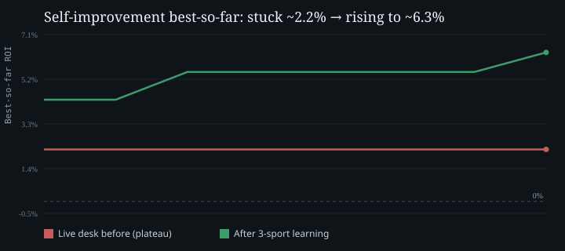
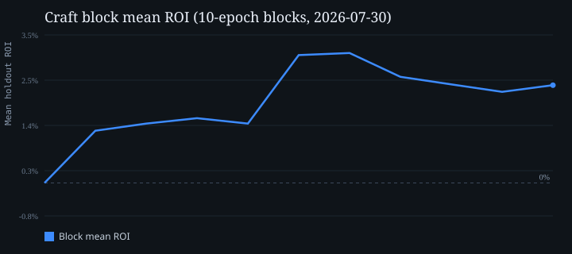
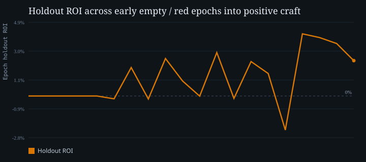
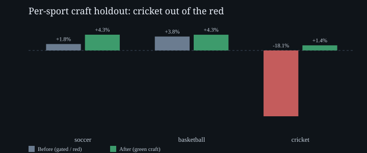

# Gambit

I built Gambit because I got tired of staring at sportsbooks without a clear read on whether a price was actually good. The site is a three-sport desk for soccer, basketball, and cricket: live boards, priced markets, model grades, a slip you control, a private portfolio journal, and a learning loop that grades its own tickets on frozen holdout data.

Gambit is **not a bookmaker**. It does not place bets for you. It does not move money. You read the desk, you decide, and if you bet at all you do it yourself on a third-party book (Stake or anyone else). Paper metrics on the Model page are research, not a promise that live betting will pay.

If that line feels blunt, good. I would rather people understand the product than get sold a fantasy.

---

## Table of contents

1. [What it actually does](#what-it-actually-does)
2. [Learning improvement (before → after)](#learning-improvement-before--after)
3. [Tech stack (detailed)](#tech-stack-detailed)
4. [Math and calculations](#math-and-calculations)
5. [Configuration variables](#configuration-variables)
6. [Runtime architecture](#runtime-architecture)
7. [Product surfaces](#product-surfaces)
8. [How we deal with the ugly parts](#how-we-deal-with-the-ugly-parts)
9. [Repo map](#repo-map)
10. [Run locally](#run-locally)
11. [Security and liability](#security-and-liability)
12. [License](#license)

---

## What it actually does

1. **Boards**  
   Pulls fixtures for soccer, basketball, and cricket. Prefer ESPN when it is up. Overlay Stake prices when a relay or browser path is warm. If both are thin, fall back to cached books or labeled model fair prices so open matches are never blank.

2. **Strength**  
   Team and player ratings from history, finished boards, and sport-specific fuel (club soccer, NBA/ABA, cricket formats). That feeds win probabilities across core markets: match result, totals, handicaps, and related lines.

3. **Prices**  
   Compare model chance to a decimal price. Edge is calibrated model probability minus the vig-free book implied chance. Verdicts on tickets are plain language (back / caution / skip), not a black box score.

4. **Slips**  
   Build singles or multis yourself. Amounts are yours. Confirm-only journals work without connecting a book. Optional Stake API token import is for history sync, not auto-betting.

5. **Portfolio**  
   Private journal per account: imported Stake history, confirmed slips, manual past bets. Settled matches update results. Optional opt-in for learning from your graded tickets.

6. **Model desk**  
   Insight boxes across corpus, craft holdout ROI, hit rate, per-sport gates, equity / self-improvement curves, market depth, and factor counts. Craft paper aims at a hard bar (**25% overall ROI**, every sport above **0%**, hit rate at least **60%**). Until that bar clears, the desk says **Below target**. It does not pretend to be ready.

---

## Learning improvement (before → after)

Craft grades tickets on a **frozen holdout** (same match IDs every epoch). Early runs were empty or underwater. After the three-sport even-money soccer fix and continued training, block means and best-so-far equity moved clearly into the green.

### Self-improvement best-so-far

Live desk used to sit on a flat **~2.2%** best-so-far curve. After the learning pass it rises toward **~6.3%**.



### Craft block mean ROI (10-epoch blocks)

First block was **0%** (empty / ungraded). Later blocks land around **2–3%** mean holdout ROI with peaks near **4%** on individual epochs.



### Epoch path: empty → red → positive

Early epochs graded **0 bets**. Then a stretch of thin or negative holdout ROI (worst about **−2.3%**). After the soccer paired-close fix, champion holdout cleared **+4.1%** with accuracy near **68%**.



### Per-sport craft holdout

Cricket craft holdout was **−18.1%** on the public desk (gated, with paired display only). After learning, soccer / basketball / cricket craft cells are all **positive**.



| Metric | Before | After (bundled desk v15) |
|--------|--------|---------------------------|
| Self-improvement best-so-far | ~2.2% flat | ~4.3% → **6.3%** rising |
| Cricket craft holdout | **−18.1%** (gated) | **+1.4%** green |
| Soccer craft tickets | often `n=0` | ~350 / epoch, ~+4.3% ROI |
| Basketball craft | ~+3.8% | ~+4.3% |
| Desk gate (25% bar) | Below target | Still Below target (honest) |

Past paper results do not guarantee live profit. The charts are holdout research, not a tip sheet.

---

## Tech stack (detailed)

| Layer | Technology | Role in Gambit |
|-------|------------|----------------|
| API | **Python 3.12**, **FastAPI**, **Uvicorn** | HTTP API, auth, portfolio, insights, odds endpoints. Lifespan binds health first; warmups run on a daemon thread so Render free tier does not hang on boot. |
| Frontend | **React 18**, **Vite 6**, **React Router** | Boards, slip, Model desk, Portfolio, Guide, legal pages. Client insights cache rejects desks below the live revision. |
| Ratings | **Elo** (`ml/elo.py`) + sport priors | Match-winner probabilities for soccer (1X2) and two-way sports (BB/cricket). |
| Markets | Poisson / ensemble hooks, market advisor, EV engine | Totals, handicaps, props where fuel exists; edge vs book after vig removal. |
| Craft learner | **sklearn MLP** (`CraftNet`), SQLite `craft.db` | Epoch train on rotating fuel; eval on frozen holdout + paired closes. |
| Pair store | SQLite `betting_evolution.db` | Historical model-fair vs close-price pairs for soccer / BB / cricket. |
| Boards | ESPN scrape/cache, Stake GraphQL/overlay, optional **The Odds API** | Primary fixtures without paid keys; Odds API is optional enricher. |
| Browser | Playwright / Browserbase / CDP (optional) | Live Stake depth when Cloudflare allows; otherwise labeled fallbacks. |
| Auth | PBKDF2-HMAC-SHA256 (120k iters), bearer sessions | Local-first accounts; no “we place bets” surface. |
| Secrets | Fernet (`GAMBIT_SECRETS_KEY`) | Stake API tokens sealed at rest when configured. |
| Persistence | JSON under `BET_PLACER_HOME`, optional Turso/`DATABASE_URL` | Users, portfolios, insights cache, factor catalog. |
| Deploy | Docker, `scripts/start_cloud.sh` | Bind `$PORT` immediately; `bootstrap_model.sh` in background. |
| Charts / desk | Cached `model_insights_cache.json` + `publish_clean_desk` | Serve path never rebuilds the full desk (OOM protection). |

### Frontend packages (high level)

- React + Vite for the SPA
- No heavy chart library required for core boards; Model desk draws SVG series from API curve arrays
- `localStorage` for auth token, age gate, bankroll/slip prefs, insights cache key `gambit_insights_v15`

### Backend packages (high level)

- `fastapi`, `uvicorn`, `pydantic` / settings
- `numpy`, `scikit-learn`, `joblib` for craft NN
- `httpx` / `requests` for ESPN and books
- Optional Playwright for Stake

---

## Math and calculations

### Elo match probabilities

For ratings \(R_h\), \(R_a\) and home advantage \(H\) (soccer default **65** Elo points; basketball **55**; cricket **20**):

\[
E_h = \frac{1}{1 + 10^{-(R_h + H - R_a)/400}}
\]

Draw mass for soccer shrinks with rating gap:

\[
d = 0.28 \cdot e^{-|R_h+H-R_a|/200}
\]

Then

\[
P(H) = E_h (1-d),\quad P(A) = (1-E_h)(1-d),\quad P(D)=d
\]

normalized to sum to 1. Basketball / cricket use a tiny draw mass (~0.02) and are treated as two-way for fair prices.

### Fair decimal odds from probability

With overround margin \(m\) (model fair often uses **1.04**):

\[
\text{odds}_i = \frac{m}{\max(P_i,\, P_{\min})}
\]

### Book implied and de-vig

Decimal odds \(O\) imply \(1/O\). Two-way and three-way vig removal lives in `markets/odds.py` (`remove_vig_two_way`, `remove_vig_three_way`) so “fair implied” is the book chance without the juice.

### Expected value and edge

\[
\mathrm{EV} = P_{\text{true}} \cdot O - 1
\]

\[
\text{edge} = P_{\text{calibrated}} - P_{\text{fair implied}}
\]

Calibration in the value finder blends model and book when they disagree modestly:

\[
P_{\text{true}} = 0.62\, P_{\text{model}} + 0.38\, P_{\text{fair}}
\]

and **drops** the pick if \(|P_{\text{model}} - P_{\text{fair}}| > 0.25\) (treat as model error, not a free lunch). Also skip if \(\mathrm{EV} > 0.25\) (unrealistic in liquid markets) or \(P_{\text{true}} < 0.45\) (longshot filter).

### Fractional Kelly stake

\[
f^* = \frac{P\cdot b - (1-P)}{b},\quad b = O - 1
\]

\[
\text{stake fraction} = \max(0,\, f^* \cdot \kappa)
\]

with \(\kappa =\) `KELLY_FRACTION` (default **0.25**). Caps: `MAX_STAKE_PCT` of bankroll, per-match `MATCH_MAX_STAKE_PCT`.

### Craft holdout ROI

For a graded book of tickets:

\[
\mathrm{ROI} = \frac{\sum \mathrm{PnL}}{\sum \text{stake}}
\]

Hit rate = wins / settled tickets. Sport ROI uses the same ratio per sport bucket (stake ≈ \(n \times\) match budget when stake is not logged).

### Craft gates (desk bar)

All must clear:

| Gate | Default |
|------|---------|
| Overall holdout ROI | \(\ge\) `TARGET_ROI` = **0.25** |
| Each of soccer, basketball, cricket ROI | \(>\) **0** |
| Holdout accuracy | \(\ge\) `TARGET_ACC` = **0.60** |
| Minimum ticket volume | `MIN_BETS` / `MIN_BETS_PER_SPORT` |

`FLOOR_P` = **0.60**: blend / model_p floor when placing craft tickets. Soccer even-money (~1.91) paired closes use a higher model_p floor (**~0.85**) so the sport actually places bets.

### Self-improvement curve

Desk equity / `craft_roi_best` is the **running maximum** of block mean ROI (best-so-far). It never declines for drama. Rising means a new graded best landed.

---

## Configuration variables

Copy `.env.example` → `.env`. Everything is optional; the app degrades with labels instead of crashing.

### Hosting and CORS

| Variable | Default / notes |
|----------|-----------------|
| `PORT` / `GAMBIT_PORT` | Render injects `PORT`; local often 8000 |
| `GAMBIT_HOST` | `0.0.0.0` on cloud |
| `BET_PLACER_HOME` | Data dir (cloud: `/var/lib/bet_placer`) |
| `GAMBIT_FRONTEND_DIST` | Built SPA path inside Docker |
| `CORS_ORIGINS` | Comma-separated allowed origins |
| `GAMBIT_CLOUD_URL` | Public base URL for relays |

### Books and boards

| Variable | Purpose |
|----------|---------|
| `ODDS_API_KEY` | The Odds API enricher (optional) |
| `STAKE_API_TOKEN` | Host-level Stake token (optional; prefer per-user portfolio token) |
| `STAKE_GRAPHQL_ENDPOINT` | Default `https://stake.com/_api/graphql` |
| `STAKE_USE_BROWSER` | Local Playwright Stake path |
| `STAKE_BROWSER_HEADLESS` | Headless Chrome |
| `STAKE_BROWSER_WARMUP_ON_STARTUP` | Pre-launch browser (default off; keep off for fast boot) |
| `BROWSERBASE_API_KEY` | Remote browser for cloud Stake |
| `STAKE_CDP_URL` | Raw CDP alternative |
| `STAKE_RELAY_SECRET` | Laptop relay auth |

### Security and admin

| Variable | Purpose |
|----------|---------|
| `GAMBIT_SECRETS_KEY` | Fernet key for sealing Stake tokens |
| `GAMBIT_ADMIN_EMAILS` | Comma-separated admin roster |
| `GAMBIT_ADMIN_SECRET` | Optional shared admin header |

### Craft and learning

| Variable | Purpose |
|----------|---------|
| `CRAFT_DISABLE` | `1` on tiny hosts: no in-process craft loop (use worker / Update desk) |

### Ensemble and staking (settings)

| Variable | Default | Meaning |
|----------|---------|---------|
| `ENSEMBLE_WEIGHT_POISSON` | 0.45 | Blend weight |
| `ENSEMBLE_WEIGHT_ELO` | 0.35 | Blend weight |
| `ENSEMBLE_WEIGHT_GBM` | 0.20 | Blend weight |
| `INTUITION_MAX_ADJUSTMENT` | 0.08 | Cap on discretionary adjust |
| `CONSENSUS_WEIGHT_BETTORS` | 0.12 | Bettor consensus pull |
| `CONSENSUS_WEIGHT_WEB` | 0.08 | Web consensus pull |
| `KELLY_FRACTION` | 0.25 | Fraction of full Kelly |
| `MIN_EV_THRESHOLD` | 0.02 | Minimum EV to surface a value bet |
| `MIN_CONFIDENCE` | 0.55 | Confidence floor |
| `MAX_STAKE_PCT` | 3.0 | Max % of bankroll |
| `MATCH_MAX_STAKE_PCT` | 50.0 | Max % of per-match budget |
| `DEFAULT_BANKROLL` | 2000 | Paper / UI default |

### Persistence

| Variable | Purpose |
|----------|---------|
| `PORTFOLIO_STORE_PATH` | Override portfolio root |
| `DATABASE_URL` / `TURSO_AUTH_TOKEN` | Optional remote DB |

---

## Runtime architecture

```
Browser (React SPA)
    │  /api/*
    ▼
FastAPI (Uvicorn)
    ├── Auth / sessions
    ├── Events provider (ESPN → Stake overlay → Odds API → demo → model fair)
    ├── Match slip / recs / EV
    ├── Stake odds (overlay → cache → board → demo → model)
    ├── Portfolio (per-user journal, sealed tokens)
    └── Model insights (disk cache + publish_clean + bundled learning merge)
            │
            ├── craft.db (epochs, sport ledger, holdout IDs)
            ├── betting_evolution.db (paired closes)
            ├── model_params.json / craft_nn.joblib
            └── factor_catalog_summary.json (bundled depth)
```

**Boot (cloud):** `start_cloud.sh` starts Uvicorn on `$PORT` immediately. `bootstrap_model.sh` runs in the background. API lifespan starts a single `api-boot` thread: DB init, users bundle, lean board warmup, optional Stake disk cache, insights ensure. Craft auto-loop only if `CRAFT_DISABLE` is unset. Stake browser / odds keepalive only if a live Stake network path is configured.

---

## Product surfaces

| Route | What you get |
|-------|----------------|
| `/` | Landing |
| `/app` | Home boards |
| `/app/sport/:id` | League board, match sheet, Recs / Build / Odds |
| `/app/model` | Desk v15: glossary, gates, curves, containers |
| `/app/portfolio` | Private journal + Stake token |
| `/app/guide` | Product guide |
| `/app/legal/terms` | Terms (liability, indemnity, as-is) |
| `/app/legal/privacy` | Privacy |
| `/app/account` | Profile / token / privacy toggles |

Odds tab fallback order when Stake is blocked: **Stake overlay → fixture cache → ESPN/board 1X2 → demo books → Elo model fair**. Every response is labeled.

---

## How we deal with the ugly parts

**Cloudflare / Stake on cloud**  
Datacenter IPs often get 403. Fallbacks keep the Odds tab priced and labeled.

**Free-tier memory**  
No full `build_model_insights` on the request path. Factors do not rebuild on HTTP. Bundled catalogs and learning fragments ship in the image.

**Cold boards**  
Keep cached priced fixtures when ESPN disk is empty. Demo boards are labeled.

**Soccer craft `n=0`**  
Paired soccer closes are synthetic ~1.91. The old 1.30–1.50 “favorite” sampler was empty. High-`model_p` even-money sampling restored soccer tickets and green sport ROI.

**Client Desk v10 stickiness**  
24h localStorage returned without revalidate. Cache key is now `gambit_insights_v15` and rejects older `cache_version`.

**Honesty**  
Below target means below target. Red craft holdout is not painted green without a note.

---

## Repo map

```
src/bet_placer/
  api/server.py          FastAPI routes + lifespan boot
  engine/                EV, advisor, bet builder, stake odds
  ml/                    Elo, craft train/NN/store, insights, desk_quality
  data/                  ESPN, providers, demo events, Stake scraper
  portfolio/             Journal + sealed tokens
  auth/                  Users + sessions
frontend/src/pages/      Model, Portfolio, Guide, Legal, boards
scripts/                 run.sh, start_cloud.sh, bootstrap, checks
docs/assets/             Learning improvement SVGs
DEPLOY.md                Render / Browserbase / secrets
```

Useful checks:

```bash
PYTHONPATH=src python3 scripts/check_stake_odds_fallback.py
```

---

## Run locally

```bash
cp .env.example .env
./scripts/run.sh
```

- App: http://127.0.0.1:5173  
- API: http://127.0.0.1:8000  

Production-style:

```bash
./scripts/run_production.sh
```

Deploy notes: [DEPLOY.md](DEPLOY.md).

---

## Security and liability

- **18+** (or legal age where you live). Age gate on first visit.
- **Not financial advice.** Model outputs can be wrong.
- **You place bets.** Gambit never submits wagers for you.
- **Comply with local law.**
- **Stake tokens:** revocable API token only; never paste your Stake password.
- **No warranty.** See Terms for limitation of liability and indemnity.

I care about this project. I also care that nobody uses it as an excuse to blow a bankroll or ignore the law.

---

## License

Proprietary. See [LICENSE](LICENSE). Copyright (c) 2026 Abhyuday Khanna. All rights reserved. Contact `abhyudayk16@gmail.com` for licensing.
